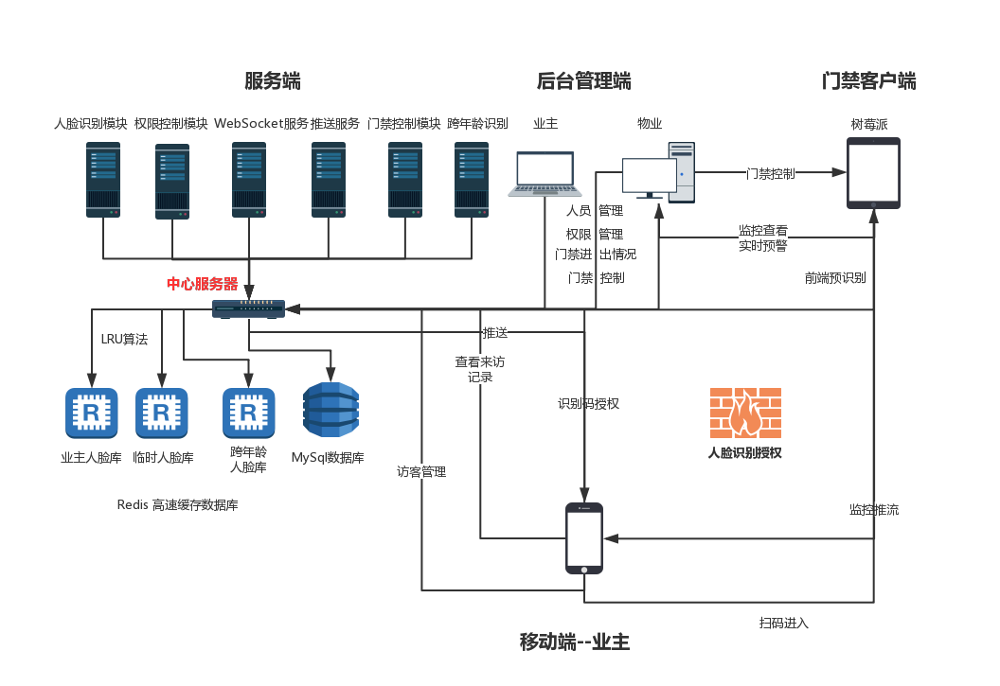
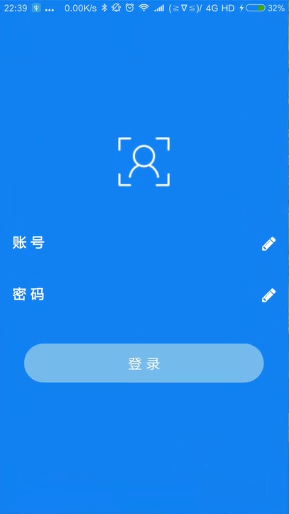
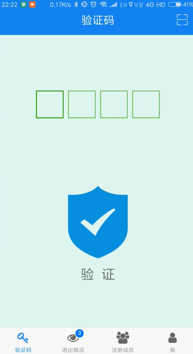
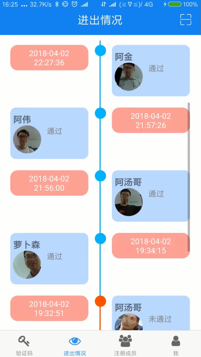
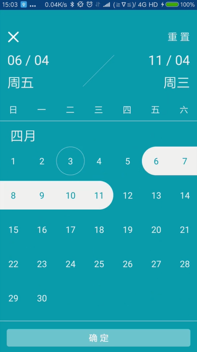
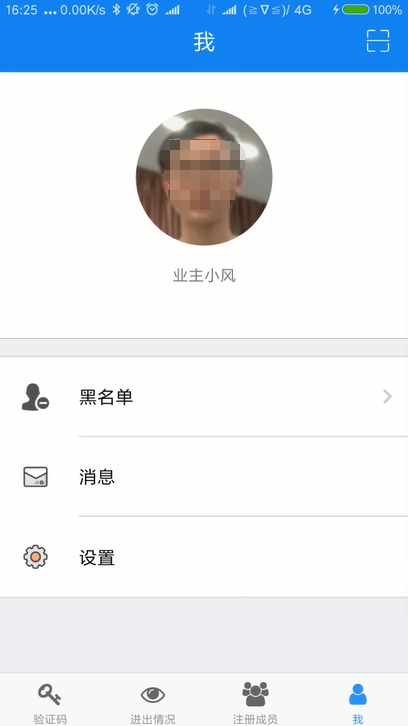
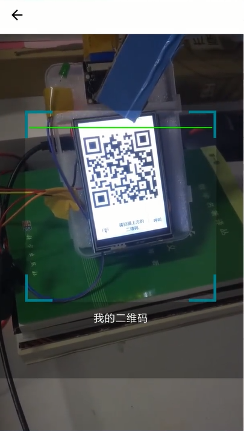

## 虹软人脸识别门禁系统 移动端

### 开发框架 ： 
React-Native

### 项目成绩：

* 获2018年浙江省大学生服务外包创新应用大赛一等奖
* 获2018年中国大学生服务外包创新创业大赛大赛三等奖

### 项目整体框架：

### 移动端概览：

(照片已做打码处理)

### 说明：

1、登录支持账号密码登录与人脸识别登录。

2、可通过门禁提供的验证码来查看来访人员信息与门禁开启授权。

3、进出情况通过时间轴的形式查看来访进历史记录。

4、注册成员管理可以进行查看添加与删除，可设置来访人员允许访问的时间段。

5、可通过右上角的扫描二维码图标来扫描二维码通过门禁（适用于人脸门禁未成功识别的情况）。

6、可通过操作门禁端来发送推送通知到APP，并在APP端查看门禁端的实时内容（与门禁处实时视频流交互）。

### 框架：

* jcore-react-native 
* jpush-react-native 
* prop-types 
* rc-animate 
* rc-queue-anim 
* rc-tween-one 
* react 
* react-native 
* react-native-action-button 
* react-native-actionsheet 
* react-native-calendar-select 
* react-native-camera 
* react-native-collapsible 
* react-native-confirmation-code-input 
* react-native-custom-actionsheet 
* react-native-easy-toast 
* react-native-elements 
* react-native-gifted-listview 
* react-native-gifted-spinner 
* react-native-image-picker 
* react-native-loading-spinner-overlay 
* react-native-material-cards 
* react-native-modal-datetime-picker 
* react-native-modal-dropdown 
* react-native-popup-dialog 
* react-native-selectmultiple-button 
* react-native-settings-list 
* react-native-storage 
* react-native-swipe-list-view 
* react-native-syan-image-picker 
* react-native-tab-navigator 
* react-native-textinput-effects 
* react-native-timeline-listview 
* react-native-vector-icons 
* react-navigation 